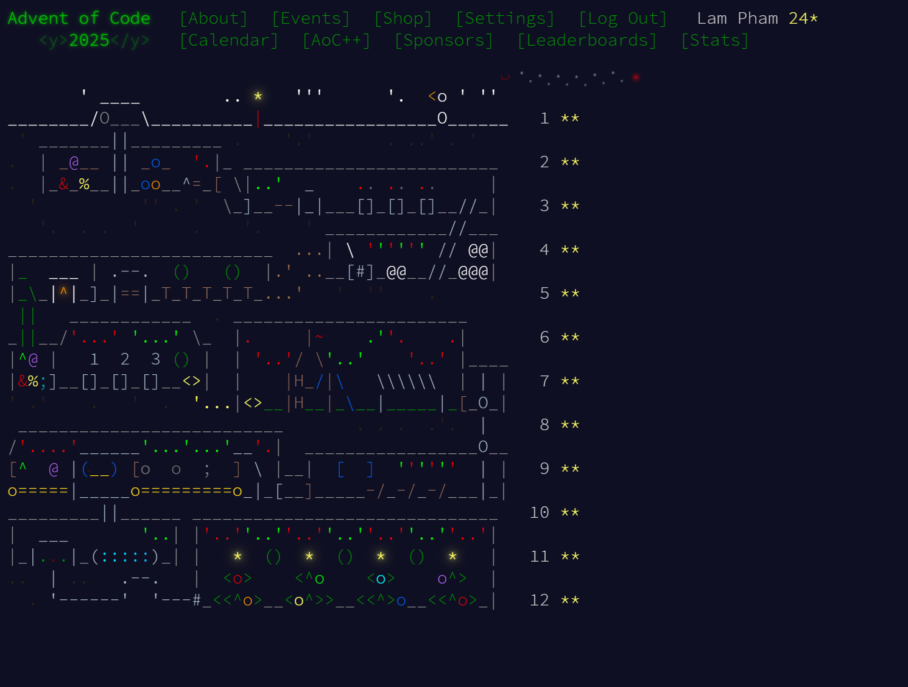

# Advent of Code 2025 Solutions - Lam Pham



## Overview

This repository contains solutions to Advent of Code 2025 challenges, implemented in Python. The problems cover various algorithmic and computational concepts including graph theory, optimization, parsing, and combinatorics.

## Project Structure

```
Advent_of_code/
├── Day_1/         Safe Dial Problem
├── Day_2/         Gift Shop Number Analysis
├── Day_3/         Lobby Joltage Calculator
├── Day_4/         Printing Department Grid
├── Day_5/         Cafeteria Ingredient Freshness
├── Day_6/         Trash Compactor Parser (Part 1)
├── Day_7/         Trash Compactor Beam Splitter
├── Day_8/         Playground MST
├── Day_9/         Movie Theater Rectangle Area
├── Day_10/        Factory Button Optimization
├── Day_11/        Reactor Path Counter
├── Day_12/        Tiling Puzzle Solver
└── images/        Progress tracking images
```

## Solutions Summary

### Day 1: Safe Dial

**Problem**: Circular dial navigation with modular arithmetic

- Track position on a 100-point dial
- Count visits to position 0
- **Approach**: Modular arithmetic for circular movement

### Day 2: Gift Shop

**Problem**: Find numbers where first half equals second half

- Parse number ranges
- Identify palindromic-half numbers
- **Approach**: String manipulation and validation

### Day 3: Lobby Joltage

**Problem**: Calculate maximum joltage from digit pairs

- Find maximum two-digit combination from each bank
- Sum all maximum values
- **Approach**: Combinatorial search with pair generation

### Day 4: Printing Department

**Problem**: Grid connectivity analysis

- Count paper rolls based on neighbor count
- 8-directional neighbor checking
- **Approach**: Grid traversal with boundary checking

### Day 5: Cafeteria

**Problem**: Ingredient freshness verification

- Check IDs against freshness ranges
- Count valid ingredients
- **Approach**: Range membership testing

### Day 6: Trash Compactor (Part 1)

**Problem**: Column-based parsing and calculation

- Split input by vertical separators
- Process individual blocks
- **Approach**: Column-wise parsing with block detection

### Day 7: Beam Splitter

**Problem**: Light beam propagation simulation

- Track beam splitting through grid
- Count total splits
- **Approach**: Set-based beam tracking with simulation

### Day 8: Playground

**Problem**: Minimum Spanning Tree construction

- Connect 3D points with minimum total distance
- **Approach**: Kruskal's algorithm with Union-Find

### Day 9: Movie Theater

**Problem**: Maximum rectangle area calculation

- Find largest rectangle from point pairs
- **Approach**: Pairwise comparison with area calculation

### Day 10: Factory Optimization

**Problem**: Button press minimization

- **Part 1**: XOR-based light toggle (GF(2) linear algebra)
- **Part 2**: Counter increment (Mixed Integer Linear Programming)
- **Approach**:
  - Part 1: Gaussian elimination over GF(2)
  - Part 2: scipy MILP solver with equality constraints

### Day 11: Reactor

**Problem**: Path counting in directed graph

- Count all paths from 'you' to 'out'
- Handle cycles and complex connectivity
- **Approach**: DFS with memoization

### Day 12: Tiling Puzzle

**Problem**: Polyomino tiling solver

- Place shapes on grid without overlap
- Handle rotations and reflections
- **Approach**: Backtracking with bitmask optimization
  - 8 symmetry variations per shape
  - Early pruning with area checking
  - Symmetry breaking for duplicate pieces
  - Memoization for state caching

## Technical Highlights

### Algorithms Used

- **Graph Theory**: DFS, BFS, MST (Kruskal's), Union-Find
- **Optimization**: Linear Programming, Integer Programming, Backtracking
- **Linear Algebra**: Gaussian Elimination (GF(2) and real numbers)
- **Computational Geometry**: Rectangle area, distance calculations
- **String Processing**: Parsing, pattern matching
- **Bit Manipulation**: Bitmask representations for grid states

## Performance Optimizations

1. **Memoization**: Used extensively in recursive solutions (Day 11, Day 12)
2. **Bitmask Representations**: Efficient grid state tracking (Day 10, Day 12)
3. **Early Pruning**: Reduces search space in backtracking (Day 12)
4. **Symmetry Breaking**: Eliminates duplicate solutions (Day 12)
5. **Efficient Data Structures**: Sets for O(1) lookups, priority queues for sorting
